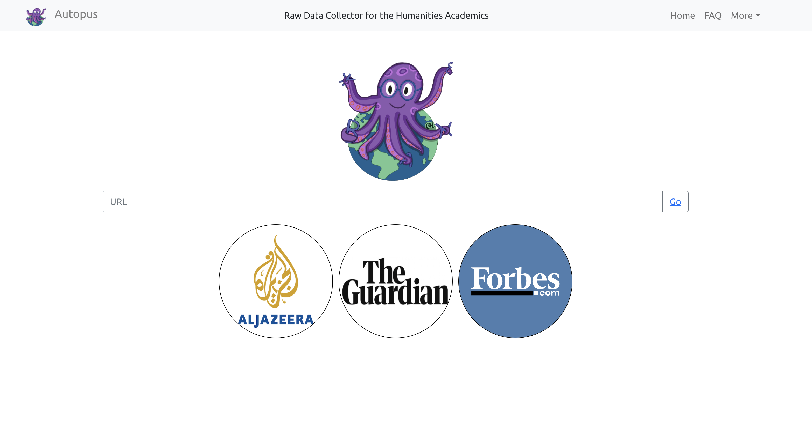
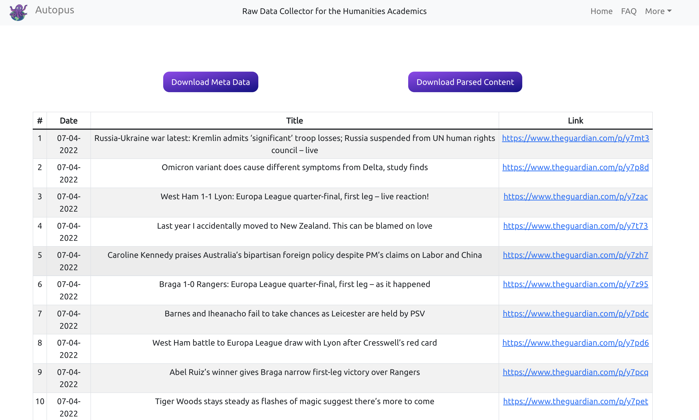

A Raw Data Collector for the Humanities Academics




## Features

- Create latest news corpus through The Guardian API.

## Quick Start

In order to run Autopus, you should include a _guardian_key_ file at the root folder of the source code as specified below:

```
<Guardian Key>

http://content.guardianapis.com/search?from-date=2016-01-02&to-date=2016-01-02&order-by=newest&show-fields=all&page-size=200&api-key=92ecbb3d-1602-42b3-acdb-e0a9d166e354
```

Run the program:

```console
$ npm start
```
